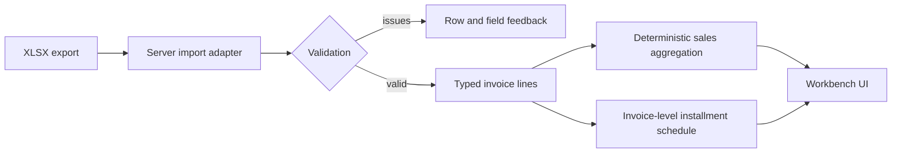

# Biomix ERP Sales Workbench

A portfolio project turning an ERP spreadsheet into trustworthy invoiced-sales reporting for commercial, finance, and product teams across Agro and Home & Garden.

**Status: milestone 2 (import + invoiced-sales report).** Upload an `.xlsx` export, get located validation issues or an accepted dataset. For an accepted dataset you see invoiced sales, distinct invoices and line counts, filters (customer, product, seller, business unit, period), and month / business-unit breakdowns with reconciliation checks. Nothing is persisted. Scheduled collections (installments) are not implemented. No dataset or business outcomes are claimed.

## Run in GitHub Codespaces (primary environment)

Development and demos run in GitHub's cloud. You only need a browser and a GitHub account; Node.js and Docker do not need to be installed on your computer.

1. Publish this project's tracked files to your GitHub repository, including `.devcontainer/`, `.github/`, and `package-lock.json`.
2. In that repository choose **Code → Codespaces → Create codespace on main** (or your chosen branch).
3. Wait for setup to finish. The container installs Node **24.21.0** and runs `npm ci` automatically; it requests at least 2 CPUs and 8 GB RAM.
4. In the **Codespace terminal**, run `npm run dev`.
5. Open **Ports → 3000 → Open in Browser** if the preview does not open automatically. Keep the port visibility **Private**.

Use the forwarded HTTPS address shown in the Ports panel (`https://<codespace-name>-3000.app.github.dev`). The Next.js server and XLSX importer run inside the Codespace; the browser displays the report. No environment file or API key is required. Claude Code authentication/subscription is separate.

The public repository lets portfolio reviewers inspect the code and create their own Codespace. Each Codespace is a development environment; an always-available public demo would require a separate deployment. See [the cloud workflow and troubleshooting guide](docs/codespaces.md), including the fresh-Codespace verification checklist.

## Optional local development

Use Node.js **24.21.0** (or `nvm install && nvm use` if you already use nvm).

```sh
npm ci
npm run dev
```

Open http://localhost:3000. Open `biomix.code-workspace` in VS Code, or open this folder directly. No environment file or API key is required; `.env.example` documents the optional telemetry setting.

## Stack and architecture

| Area | Choice | Reason |
| --- | --- | --- |
| Runtime | Node 24 + npm lockfile | Same runtime locally, in CI, and Codespaces |
| Application | Next.js App Router, React, strict TypeScript | One application for UI and server-side imports |
| Styling | Plain CSS | Small foundation with no component-library setup |
| XLSX and validation | ExcelJS 4.4.0 adapter + hand-written strict field parsers (`src/domain/sales-import/`) | Explicit spreadsheet parsing and located, actionable validation issues |
| Calculations | Pure TypeScript; integer BRL cents | Reviewable, deterministic arithmetic |
| Storage | None: accepted data lives only in the uploading browser tab | Session-scoped by construction; add SQLite only if persistence is justified |
| Checks | ESLint, TypeScript, Vitest behavior tests, build | Import contract is tested with tiny fictional in-memory workbooks |



Everything except the installment schedule (milestone 3) is implemented. See [the architecture decision](docs/architecture.md) and [data contract](docs/data-contract.md).

## Verification

```sh
npm run check
```

This runs lint, type checking, the Vitest behavior suite (`npm test`), and a production build. CI runs the same command. The tests cover the import contract, input resource limits, the upload handler and the report aggregation. Browser interaction is not covered by automated tests.

## Development workflow

Development proceeds through bounded milestones, implementation reviews and recorded verification. Business decisions and acceptance checks remain the maintainer's responsibility.

- Read [the contributor guidance](CLAUDE.md) and [the data contract](docs/data-contract.md).
- Follow [the milestone plan](docs/milestones.md).
- Send review requests using [the review checklist/template](docs/review.md).
- See [context and boundaries](docs/project-context.md) before changing scope.

## Data definitions and limits

One row is an invoice product line. Count distinct invoices, not rows. Sales are invoiced purchases; scheduled collections are contractual dates and amounts, not actual payments or balances. Money is BRL; package count, mass, and volume are separate measures. Invalid or contradictory dates need explicit resolution.

Only project source, configuration, technical documentation and fictional test values belong in this repository. Do not publish personal details, credentials, source exports, real customer/seller identities, tax IDs or unreviewed uploads. No full synthetic dataset is included. See [data handling](data/README.md).

Project 2 will be an independently runnable sales investigation copilot. Project 3 will be an independently runnable n8n follow-up agent with human-approved demo tasks. Both are deferred until Project 1 is complete. No live WhatsApp sending, ERP integration, application authentication system, production hosting, or production readiness is included. Cloud development uses GitHub Codespaces.

## Contribution and AI assistance

This portfolio demonstrates translating sales operations requirements into working software. Codex assisted with environment setup, documentation and review; Claude Code assisted with application implementation. Business decisions and acceptance validation are maintained separately from AI-generated implementation. Demonstrated results must be labeled synthetic where applicable.
