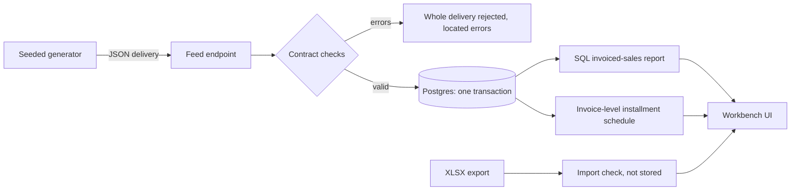

# Biomix ERP Sales Workbench

A portfolio project turning an ERP spreadsheet into trustworthy invoiced-sales reporting for commercial, finance, and product teams across Agro and Home & Garden.

**Status: milestone 4 (Postgres and delivery ingestion), implemented and awaiting review.** `npm run generate:data` produces reproducible fictional monthly deliveries ([synthetic data](docs/synthetic-data.md)). `POST /api/sales-feed/deliveries` checks each delivery against the [clean-feed contract](docs/sales-feed-contract.md) ([OpenAPI](docs/api/sales-feed.openapi.json)) and applies it to Postgres in one transaction, or rejects it whole with located errors ([database guide](docs/database.md)). The report reads the stored invoices: invoiced sales, distinct invoices and line counts, filters (customer, product, seller, business unit, period), and month / business-unit breakdowns with reconciliation checks. The earlier XLSX upload still validates a workbook and reports on it in the browser without storing it. Scheduled collections (installments) are not implemented yet. No business outcomes are claimed; generated figures are synthetic.

## Run in GitHub Codespaces (primary environment)

Development and demos run in GitHub's cloud. You only need a browser and a GitHub account; Node.js and Docker do not need to be installed on your computer.

1. Publish this project's tracked files to your GitHub repository, including `.devcontainer/`, `.github/`, and `package-lock.json`.
2. In that repository choose **Code → Codespaces → Create codespace on main** (or your chosen branch).
3. Wait for setup to finish. The container installs Node **24.21.0**, starts Postgres 17, runs `npm ci`, creates a local development API key (`.env.local`) and migrates the database; it requests at least 2 CPUs and 8 GB RAM. An existing Codespace created before milestone 4 needs **Codespaces: Rebuild Container**.
4. In the **Codespace terminal**, run `npm run dev`.
5. Open **Ports → 3000 → Open in Browser** if the preview does not open automatically. Keep the port visibility **Private**.
6. To fill the report, generate the synthetic feed and send it, in a second terminal: `npm run generate:data`, then `npm run feed:send -- data/generated/feed/deliveries` (see [the database guide](docs/database.md)).

Use the forwarded HTTPS address shown in the Ports panel (`https://<codespace-name>-3000.app.github.dev`). The Next.js server, Postgres and the XLSX importer run inside the Codespace; the browser displays the report. No external API key is required; the feed's development key is generated locally and never committed. Claude Code authentication/subscription is separate.

The public repository lets portfolio reviewers inspect the code and create their own Codespace. Each Codespace is a development environment; an always-available public demo would require a separate deployment. See [the cloud workflow and troubleshooting guide](docs/codespaces.md), including the fresh-Codespace verification checklist.

## Optional local development

Use Node.js **24.21.0** (or `nvm install && nvm use` if you already use nvm).

```sh
npm ci
npm run setup:env      # random development API key in .env.local
npm run db:migrate     # needs a Postgres 17 and DATABASE_URL, see docs/database.md
npm run dev
```

Open http://localhost:3000. Open `biomix.code-workspace` in VS Code, or open this folder directly. `.env.example` lists the settings (`DATABASE_URL`, `SALES_FEED_API_KEY`, telemetry).

## Stack and architecture

| Area | Choice | Reason |
| --- | --- | --- |
| Runtime | Node 24 + npm lockfile | Same runtime locally, in CI, and Codespaces |
| Application | Next.js App Router, React, strict TypeScript | One application for UI, the feed endpoint and server-side imports |
| Styling | Plain CSS | Small foundation with no component-library setup |
| XLSX and validation | ExcelJS 4.4.0 adapter + hand-written strict field parsers (`src/domain/sales-import/`) | Explicit spreadsheet parsing and located, actionable validation issues |
| Calculations | Pure TypeScript; integer BRL cents | Reviewable, deterministic arithmetic |
| Storage | Postgres 17 in the dev container; plain SQL, versioned migration files, `pg` driver, no ORM | Several consumers share the clean data; see [decision 002](docs/architecture-002-clean-data-platform.md) and [the database guide](docs/database.md) |
| Clean feed | Hand-written JSON contract validator (`src/domain/sales-feed/`) + OpenAPI 3.1 description; endpoint and ingestion in `src/server/sales-feed/` | Located errors per invoice, line and field; whole-delivery rejection; one transaction per delivery; idempotent delivery IDs |
| Synthetic data | Seeded generator (`src/synthetic-data/`), run by Node 24 directly | Same seed, same output; planted scenarios only in a separate answer key |
| Checks | ESLint, TypeScript, Vitest behavior tests (including Postgres tests), build | Tiny fictional fixtures; the seeded feed for SQL-vs-TypeScript report parity |



Everything except the installment schedule (milestone 5) is implemented. See [the architecture decision](docs/architecture.md) and [data contract](docs/data-contract.md).

## Verification

```sh
npm run check
```

This runs lint, type checking, the Vitest behavior suite (`npm test`), and a production build. CI runs the same command with a Postgres service. The tests cover the import contract, input resource limits, the upload handler, the report aggregation, the delivery contract and its OpenAPI description, and the synthetic generator (determinism, contract compliance, targets, territories, planted scenarios). They also cover delivery ingestion against Postgres: rejection without changes, whole-invoice replacement, untouched absent invoices, territory and ownership checks, idempotent delivery IDs, rollback on failure, the endpoint's request checks, and SQL report totals equal to the pure report module on the full seeded feed. The database tests need `DATABASE_URL`: they are skipped with a warning without it, except in CI. Browser interaction is not covered by automated tests.

## Development workflow

Development proceeds through bounded milestones, implementation reviews and recorded verification. Business decisions and acceptance checks remain the maintainer's responsibility.

- Read [the contributor guidance](CLAUDE.md) and [the data contract](docs/data-contract.md).
- Follow [the milestone plan](docs/milestones.md).
- Send review requests using [the review checklist/template](docs/review.md).
- See [context and boundaries](docs/project-context.md) before changing scope.

## Data definitions and limits

One row is an invoice product line. Count distinct invoices, not rows. Sales are invoiced purchases; scheduled collections are contractual dates and amounts, not actual payments or balances. Money is BRL; package count, mass, and volume are separate measures. Invalid or contradictory dates need explicit resolution.

Only project source, configuration, technical documentation and fictional test values belong in this repository. Do not publish personal details, credentials, source exports, real customer/seller identities, tax IDs or unreviewed uploads. No generated dataset is included: `npm run generate:data` writes it to the Git-ignored `data/generated/`, and the database lives in the dev container's volume. See [data handling](data/README.md).

Project 2 will be an independently runnable sales investigation copilot. Project 3 will be an independently runnable n8n follow-up agent with human-approved demo tasks. Both are deferred until Project 1 is complete. No live WhatsApp sending, ERP integration, application authentication system, production hosting, or production readiness is included. Cloud development uses GitHub Codespaces.

## Contribution and AI assistance

This portfolio demonstrates translating sales operations requirements into working software. Codex assisted with environment setup, documentation and review; Claude Code assisted with application implementation. Business decisions and acceptance validation are maintained separately from AI-generated implementation. Demonstrated results must be labeled synthetic where applicable.
